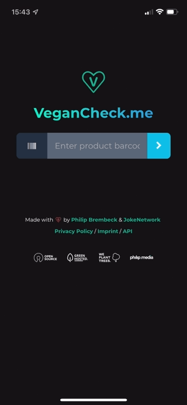

 
 <h1 align="center">VeganCheck.me</h1>
 
Check if a product is vegan or not with <a href="https://vegancheck.me">VeganCheck.me</a>

  

	
	
  
	
	
	
	
	
  

  
## 🌱 Progressive Web App

[Open PWA in browser](https://vegancheck.me) - [Product page on JokeNetwork.de](https://jokenetwork.de/#projects)

 

## 👨🏼‍💻 Overview

VeganCheck.me checks the EAN or UPC code of a product and tells you if it is vegan or not. It is an useful tool for vegans and vegetarians - Developed with usability and simplicity in mind, so without distracting irrelevant facts or advertising.

## ☑️ ToDo 

VeganCheck.me continues to develop permanently - This happens slowly but steadily to ensure that all functions work properly and are positively received by users. 

* [ ] Options for vegetarians
* [ ] Sustainability assessment

## 🧩 Contribute
This repo is mainly maintained by the team of [@jokenetwork](https://github.com/jokenetwork) ([JokeNetwork.de](https://jokenetwork.de)), but you can also help, if you want to!

**What we currently need help with:**
* [ ] Check the french translation (Ideally native speaker)
* [ ] Check the spanish translation (Ideally native speaker)
* [ ] Check the dutch translation (Ideally native speaker)
* [ ] Localize to russian (Ideally native speaker)
* [ ] Localize to arabic (Ideally native speaker)
* [ ] Localize to hindi (Ideally native speaker)
* [ ] Localize to mandarin (Ideally native speaker)

## 🤝 Dependencies & Credits 

This repo uses:

* [JQuery](https://jquery.com) @jQuery
* [BarCode-reader](https://github.com/iemadk/BarCode-reader) [@iemadk](https://github.com/iemadk)
* [pwa-install-prompt](https://github.com/JacobDB/pwa-install-prompt) [@JacobDB](https://github.com/JacobDB)
* [OpenFoodFacts API](https://openfoodfacts.org/) [@openfoodfacts](https://github.com/openfoodfacts)

## 👩‍⚖️ License

All text and code in this repository is licensed under [MIT](https://github.com/jokenetwork/VeganCheck.me/blob/main/LICENSE), © 2021 Philip Brembeck, © 2021 JokeNetwork.
