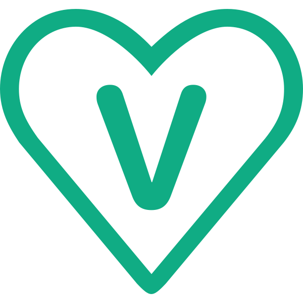
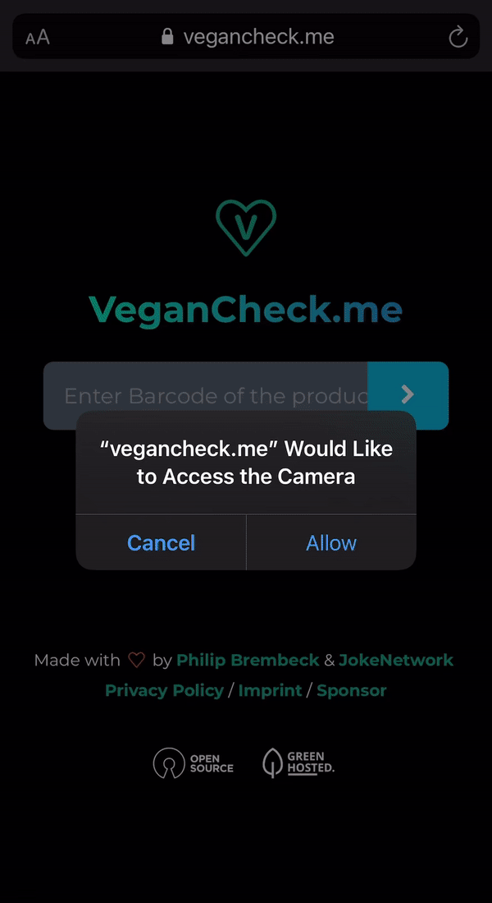

 
 <h1 align="center">VeganCheck.me</h1>
 
Check if a product is vegan or not with <a href="https://vegancheck.me">VeganCheck.me</a>

  

  
	
  
	
	
	
	
  

VeganCheck.me checks the EAN or UPC-Code of a product and simply tells you if it's vegan or not.

VeganCheck.me is meant as an useful tool for vegans and vegetarians - Developed with usability in mind. 

[Product page on JokeNetwork.de](https://jokenetwork.de/#projects)

## 👨🏼‍💻 Overview

## ☑️ ToDo 

Integrate: 

* [x] Nutri-Score integration (Currently testing)
* [ ] Options for vegetarians
* [ ] Sustainability assessment

## 🤝 Credits 

This repo will be further maintained by [@jokenetwork](https://github.com/jokenetwork) ([JokeNetwork.de](https://jokenetwork.de))

This repo uses:

* [JQuery](https://jquery.com)
* [OpenFoodFacts API](https://openfoodfacts.org)
* [BarCode-reader](https://github.com/iemadk/BarCode-reader) by [Emad Kamal](https://github.com/iemadk)

## 👩‍⚖️ License

All text and code in this repository is licensed under [MIT](https://github.com/philipbrembeck/VeganCheck.me/blob/main/LICENSE).
