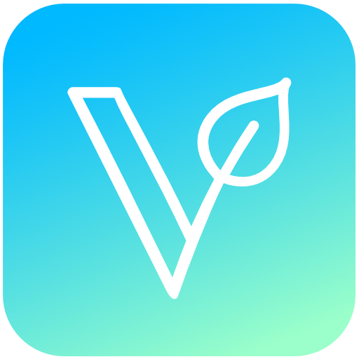

 

<h3 align="center">VeganCheck.me</h3>

  Check if a product is vegan or not with <a href="https://vegancheck.me"><strong>» VeganCheck.me</strong></a>

<a href="https://vegancheck.me">Open PWA in browser</a> | <a href="https://jokenetwork.de/#projects">Product page on JokeNetwork.de</a> | <a href="https://jokenetwork.de/vegancheck-api">Use the API</a> | <a href="https://shareshortcuts.com/shortcuts/2224-vegancheck.html">iOS Shortcut</a> | <a href="https://stats.uptimerobot.com/LY1gRuP5j6">Uptime Status</a>

 

 
## Overview
VeganCheck.me checks the barcode (EAN or UPC) of a food- or non-food-product and tells you if it is vegan or not. It is an useful tool for vegans and vegetarians - Developed with usability and simplicity in mind, so without distracting irrelevant facts or advertising.
	
VeganCheck.me combines the Databases of OpenFoodFacts, OpenBeautyFacts and Open EAN Database, as well as our very own ingredient checker in one tool. 

  
See an example of how it works!

  
  

	

	
The [VeganCheck Ingredients API](https://github.com/JokeNetwork/VeganCheck.me-API) checks the products ingredients against a list of thousands of non-vegan items.

## Status

	
## Installation
[Click here to see the installation guide!](https://jokenetwork.github.io/vegancheck.me/)

## Contribute & Support
We're happy you want to help! Please read our [Code of Conduct](https://github.com/JokeNetwork/vegancheck.me/blob/main/CODE_OF_CONDUCT.md).

Please refer to our issue trackers to see where you could help: 
- [[Roadmap] v3.x](https://github.com/JokeNetwork/vegancheck.me/issues/152)
- [[Tasks] Code Improvements](https://github.com/JokeNetwork/vegancheck.me/issues/52)
- [[Tasks] Localization](https://github.com/JokeNetwork/vegancheck.me/issues/59)

or if you find something else you could improve, just open a new issue for it!

### Support us

  

 

### Premium Supporters
<a href="https://veganism.social/@mvtracing">
	<picture>
	  <source srcset="https://user-images.githubusercontent.com/4144601/218593453-28333f8a-3e24-46d2-8bc9-856eb2e4a390.png" media="(prefers-color-scheme: dark)" width="120">
	  
	</picture>
</a>

<a href="https://philip.media">
	<picture>
	  <source srcset="https://user-images.githubusercontent.com/4144601/218594015-e28f4b94-c6ac-4ad7-842f-83296adc9d74.svg" media="(prefers-color-scheme: dark)" width="160">
	  
	</picture>
</a>

## Dependencies & Credits 

This repo uses:
* [Quagga.js](https://serratus.github.io/quaggaJS/)
* [OpenFoodFacts API](https://openfoodfacts.org/) & [OpenBeautyFacts API](https://openbeautyfacts.org/) [@openfoodfacts](https://github.com/openfoodfacts)
* [Open EAN Database](https://opengtindb.org)

## License

All text and code in this repository is licensed under [MIT](https://github.com/jokenetwork/VeganCheck.me/blob/main/LICENSE), © 2023 Philip Brembeck, © 2023 JokeNetwork.
